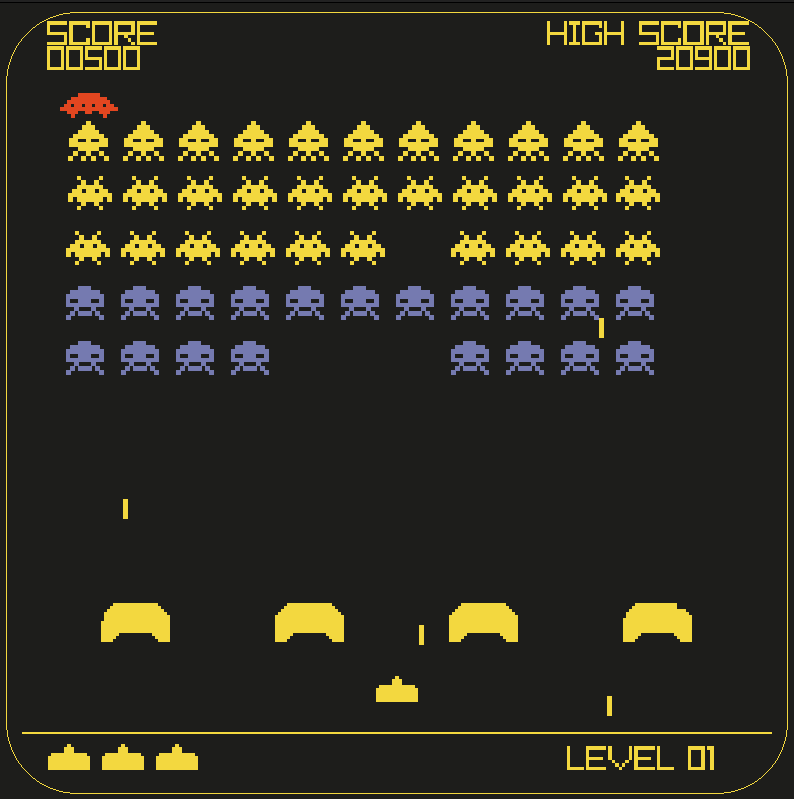

# Space Invaders (C++ Raylib)

A classic Space Invaders clone built in C++ using the [raylib](https://www.raylib.com/) game library.  
Inspired by the [Programming with Nick Space Invaders Tutorial](https://www.youtube.com/watch?v=TGo3Oxdpr5o).

## Features

- Classic arcade gameplay: shoot aliens, dodge lasers, and defend your spaceship!
- Multiple alien types and levels
- Obstacles for cover
- Mystery ship for bonus points
- High score tracking (saved to `highscore.txt`)
- Retro pixel art and sound effects
- Additions:
    - Level progression with increasing difficulty
    - Restart functionality

## Screenshots

  

## Getting Started

### Prerequisites

- C++ compiler (e.g., g++)
- [raylib](https://www.raylib.com/) installed on your system

### Build Instructions

1. **Clone the repository**
    ```sh
    git clone <your-repo-url>
    cd space_invaders
    ```

2. **Build the game**
    ```sh
    cd src
    bash build.bash
    ```

3. **Run the game**
    ```sh
    ./main
    ```

### Controls

- **Left Arrow**: Move left
- **Right Arrow**: Move right
- **Space**: Fire laser
- **Enter**: Restart after game over

## File Structure

- `src/` - Source code (C++ files)
- `assets/` - Game assets (images, sounds, fonts)
- `highscore.txt` - Stores the highest score
- `README.md` - This file

## Credits

- Tutorial: [Programming with Nick](https://www.youtube.com/@ProgrammingWithNick)
- Game framework: [raylib](https://www.raylib.com/)
- Art & Sound: Provided in `assets/` or created for this project

## License

This project is for educational purposes.  
Refer to the original tutorial and raylib for their respective licenses.